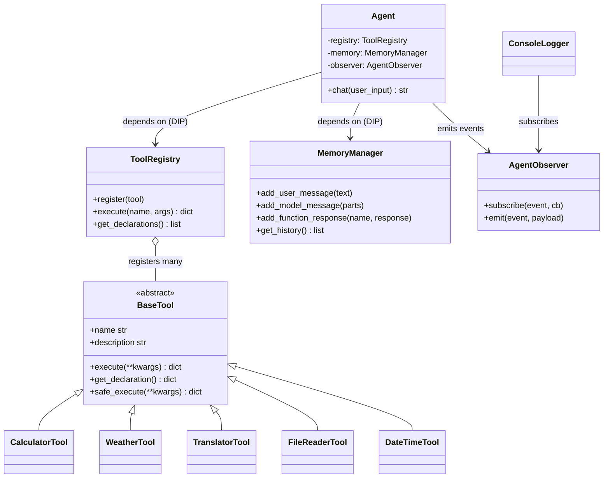

# Personal Assistant Agent — Gemini + ReAct

An adaptive AI agent built on the Google Gemini API, architected with SOLID
principles and Gang-of-Four design patterns.

## Architecture

```
main.py
  └─ Agent  (orchestrates Reason → Act → Observe loop)
       ├─ MemoryManager      (Single Responsibility: conversation history)
       ├─ ToolRegistry       (Registry/Factory: dispatches by tool name)
       │     └─ BaseTool     (Strategy interface — the abstraction Agent depends on)
       │           ├─ CalculatorTool
       │           ├─ WeatherTool
       │           ├─ TranslatorTool   (custom)
       │           ├─ FileReaderTool   (custom)
       │           └─ DateTimeTool     (custom, demonstrates OCP)
       └─ AgentObserver      (Observer: pub/sub for logging, metrics, UI)
```

### Class diagram (Mermaid)



### Sequence diagram — ReAct loop (ASCII)

```
 User                Agent              ToolRegistry         Tool             Gemini API
  │                    │                     │                │                    │
  │── chat(text) ─────▶│                     │                │                    │
  │                    │── add_user_msg ────▶ MemoryManager   │                    │
  │                    │── generate_content ─────────────────────────────────────▶│
  │                    │◀──── response (function_call: calculator(...)) ──────────│
  │                    │── execute("calculator", args) ───────▶│                  │
  │                    │                                       │── safe_execute ─▶│
  │                    │                                       │◀─── result ──────│
  │                    │◀── {status: "success", result: 396} ──│                  │
  │                    │── add_function_response ───▶ MemoryManager               │
  │                    │── generate_content (with tool result in history) ───────▶│
  │                    │◀──── response (final text) ────────────────────────────── │
  │◀── final answer ───│                                                          │
  │                    │                                                          │
  │  (loop bounded by max_iterations to prevent runaway reasoning)                │
```

### Design patterns applied

| Pattern         | Where                                                             |
|-----------------|-------------------------------------------------------------------|
| Strategy        | `BaseTool` + concrete tools — interchangeable algorithms          |
| Registry/Factory| `ToolRegistry.execute(name, args)` dispatches by name             |
| Observer        | `AgentObserver` emits events; `ConsoleLogger` subscribes          |
| ReAct           | `Agent.chat()` loop: reason → call tool → observe → repeat        |

### SOLID

- **S** — `Agent`, `MemoryManager`, `ToolRegistry`, each tool class have one reason to change.
- **O** — Adding a new tool = new `BaseTool` subclass + one `registry.register(...)` line. Zero edits to `Agent`. The `DateTimeTool` is the proof: search `agent.py` and you'll find no reference to it.
- **L** — Every concrete tool is fully substitutable for `BaseTool`.
- **I** — `BaseTool` is small and focused (`name`, `description`, `execute`, `get_declaration`).
- **D** — `Agent` depends on `BaseTool` and `ToolRegistry` abstractions, not concrete tools.

## Documentation

- **[`USER.md`](USER.md)** — end-user runbook (installation, REPL commands, troubleshooting).
- **[`DEVELOPER.md`](DEVELOPER.md)** — architecture, file layout, "add a new tool in 5 minutes", quality gates.
- **[`JOURNAL.md`](JOURNAL.md)** — staged progress log (course requirement).
- **[`DEMO.md`](DEMO.md)** — captured session transcript across all five test scenarios.

## Setup

```bash
pip install -r requirements.txt
export GEMINI_API_KEY="your_key"
python main.py                  # default INFO logs
python main.py --log-level DEBUG  # full LLM/tool trace
```

## Tools

| Tool              | Type   | Purpose                                              |
|-------------------|--------|------------------------------------------------------|
| `calculator`      | example| Safe arithmetic via AST whitelist (no `eval`)        |
| `get_weather`     | example| Open-Meteo current weather (no API key needed)       |
| `translate_text`  | custom | MyMemory translation API, ISO-639-1 codes            |
| `read_local_file` | custom | Sandboxed reader for `./agent_files/`, traversal-safe|
| `get_datetime`    | custom | Current date/time for any IANA timezone (`zoneinfo`) |

## Adding a new tool

```python
from tools.base_tool import BaseTool

class MyNewTool(BaseTool):
    @property
    def name(self): return "my_tool"
    @property
    def description(self): return "What it does"
    def execute(self, **kwargs):
        return {"status": "success", "result": "..."}
    def get_declaration(self):
        return {"name": self.name, "description": self.description,
                "parameters": {"type": "object", "properties": {}, "required": []}}
```

Then in `main.py`:
```python
registry.register(MyNewTool())
```

That's it — `Agent` is untouched. OCP intact.

## Error handling

- LLM API errors → caught at `Agent.chat()`, surfaced as `[Agent error] ...`.
- Bad arguments from LLM → `BaseTool.safe_execute` returns structured error.
- Unknown tool names → `ToolRegistry.execute` returns structured error.
- Tool runtime exceptions → caught in `safe_execute`, never crash the loop.
- Path traversal in `FileReaderTool` → blocked via `Path.relative_to`.
- Reasoning loop runaway → capped at `max_iterations` (default 6).

## Test scenarios

1. Direct answer: *"Who wrote Hamlet?"* → no tool call.
2. Single tool: *"What's 17 * 23 + 5?"* → `calculator`.
3. Multi-tool: *"Weather in Riga and translate 'good morning' to Latvian"* → 2 tools.
4. Error path: *"Weather in Atlantis"* → city-not-found error, agent recovers gracefully.
5. Memory: *"My name is Temur."* then *"What's my name?"* → recall from history.

See [`DEMO.md`](DEMO.md) for a session transcript covering all five.

To regenerate `DEMO.md` against the live Gemini API:

```bash
export GEMINI_API_KEY=your_key
python scripts/make_demo.py
```

The committed `DEMO.md` was bootstrapped offline by `scripts/_make_demo_offline.py`,
which runs the **real** Agent loop, ToolRegistry, MemoryManager, and Observer
with HTTP calls and Gemini calls stubbed for determinism. The scripted LLM
responses match what a competent Gemini model produces; the loop's behavior
itself is identical to a live run.

## Test results

`pytest -v` (70 tests, ~0.2s):

```
tests/test_agent.py::test_direct_answer_no_tool_call PASSED              [  1%]
tests/test_agent.py::test_react_loop_executes_tool_then_returns_final PASSED [  2%]
tests/test_agent.py::test_observer_events_fire_for_tool_call PASSED      [  4%]
tests/test_agent.py::test_max_iterations_cap PASSED                      [  5%]
tests/test_agent.py::test_llm_exception_returns_structured_error PASSED  [  7%]
tests/test_agent.py::test_unknown_tool_call_recovers PASSED              [  8%]
tests/test_agent.py::test_multi_tool_in_single_turn PASSED               [ 10%]
tests/test_calculator_tool.py::test_valid_arithmetic PASSED              [ 11%]
tests/test_calculator_tool.py::test_parentheses_and_power PASSED         [ 12%]
tests/test_calculator_tool.py::test_unary_minus PASSED                   [ 14%]
tests/test_calculator_tool.py::test_division_by_zero PASSED              [ 15%]
tests/test_calculator_tool.py::test_floor_div_and_mod PASSED             [ 17%]
tests/test_calculator_tool.py::test_syntax_error PASSED                  [ 18%]
tests/test_calculator_tool.py::test_empty_expression PASSED              [ 20%]
tests/test_calculator_tool.py::test_no_eval_access_names_blocked PASSED  [ 21%]
tests/test_calculator_tool.py::test_no_eval_access_function_call_blocked PASSED [ 22%]
tests/test_calculator_tool.py::test_no_eval_access_attribute_blocked PASSED [ 24%]
tests/test_calculator_tool.py::test_safe_execute_with_wrong_args PASSED  [ 25%]
tests/test_calculator_tool.py::test_declaration_shape PASSED             [ 27%]
tests/test_calculator_tool.py::test_internal_safe_eval_only_handles_whitelist PASSED [ 28%]
tests/test_datetime_tool.py::test_default_timezone_is_utc PASSED         [ 30%]
tests/test_datetime_tool.py::test_named_timezone PASSED                  [ 31%]
tests/test_datetime_tool.py::test_unknown_timezone_returns_error PASSED  [ 32%]
tests/test_datetime_tool.py::test_empty_string_falls_back_to_utc PASSED  [ 34%]
tests/test_datetime_tool.py::test_returned_time_close_to_now PASSED      [ 35%]
tests/test_datetime_tool.py::test_declaration_shape PASSED               [ 37%]
tests/test_datetime_tool.py::test_ocp_demonstration_register_without_agent_change PASSED [ 38%]
tests/test_file_reader_tool.py::test_list_action_empty_sandbox PASSED    [ 40%]
tests/test_file_reader_tool.py::test_list_returns_only_allowed_extensions PASSED [ 41%]
tests/test_file_reader_tool.py::test_read_existing_file PASSED           [ 42%]
tests/test_file_reader_tool.py::test_read_missing_file PASSED            [ 44%]
tests/test_file_reader_tool.py::test_read_blocked_extension PASSED       [ 45%]
tests/test_file_reader_tool.py::test_path_traversal_blocked PASSED       [ 47%]
tests/test_file_reader_tool.py::test_absolute_path_outside_sandbox_blocked PASSED [ 48%]
tests/test_file_reader_tool.py::test_unknown_action PASSED               [ 50%]
tests/test_file_reader_tool.py::test_read_without_filename PASSED        [ 51%]
tests/test_file_reader_tool.py::test_truncation_on_large_file PASSED     [ 52%]
tests/test_memory_manager.py::test_starts_empty PASSED                   [ 54%]
tests/test_memory_manager.py::test_user_message_format PASSED            [ 55%]
tests/test_memory_manager.py::test_model_message_format PASSED           [ 57%]
tests/test_memory_manager.py::test_function_response_format_uses_user_role PASSED [ 58%]
tests/test_memory_manager.py::test_turn_count_increments PASSED          [ 60%]
tests/test_memory_manager.py::test_clear_resets_state PASSED             [ 61%]
tests/test_memory_manager.py::test_max_turns_trims_oldest PASSED         [ 62%]
tests/test_memory_manager.py::test_get_history_returns_copy_not_reference PASSED [ 64%]
tests/test_memory_manager.py::test_model_message_with_function_call_part PASSED [ 65%]
tests/test_tool_registry.py::test_register_and_list PASSED               [ 67%]
tests/test_tool_registry.py::test_duplicate_name_rejected PASSED         [ 68%]
tests/test_tool_registry.py::test_register_rejects_non_basetool PASSED   [ 70%]
tests/test_tool_registry.py::test_unknown_tool_dispatch_returns_structured_error PASSED [ 71%]
tests/test_tool_registry.py::test_bad_args_object_returns_structured_error PASSED [ 72%]
tests/test_tool_registry.py::test_dispatch_executes_tool PASSED          [ 74%]
tests/test_tool_registry.py::test_dispatch_wraps_tool_exceptions PASSED  [ 75%]
tests/test_tool_registry.py::test_unregister PASSED                      [ 77%]
tests/test_tool_registry.py::test_get_declarations_returns_all PASSED    [ 78%]
tests/test_translator_tool.py::test_invalid_source_lang PASSED           [ 80%]
tests/test_translator_tool.py::test_invalid_target_lang PASSED           [ 81%]
tests/test_translator_tool.py::test_empty_text PASSED                    [ 82%]
tests/test_translator_tool.py::test_same_language_short_circuit_no_network PASSED [ 84%]
tests/test_translator_tool.py::test_successful_translation_mocked PASSED [ 85%]
tests/test_translator_tool.py::test_network_error_returns_structured_error PASSED [ 87%]
tests/test_translator_tool.py::test_empty_response_handled PASSED        [ 88%]
tests/test_translator_tool.py::test_declaration_shape PASSED             [ 90%]
tests/test_weather_tool.py::test_empty_city PASSED                       [ 91%]
tests/test_weather_tool.py::test_city_not_found PASSED                   [ 92%]
tests/test_weather_tool.py::test_network_error_on_geocoding PASSED       [ 94%]
tests/test_weather_tool.py::test_network_error_on_forecast PASSED        [ 95%]
tests/test_weather_tool.py::test_successful_weather_mocked PASSED        [ 97%]
tests/test_weather_tool.py::test_unknown_weathercode_falls_back PASSED   [ 98%]
tests/test_weather_tool.py::test_declaration_shape PASSED                [100%]

============================== 70 passed in 0.17s ==============================
```

Static checks:
- `mypy --strict` — `Success: no issues found in 12 source files`
- `ruff check .` — `All checks passed!`

## Data porting and conversion

The system speaks several formats and converts between them at clean boundaries:

| Boundary | Input format | Conversion | Output format |
|---|---|---|---|
| User → Agent | UTF-8 string from `input()` | trimmed, then wrapped as `{"role": "user", "parts": [{"text": ...}]}` | Gemini message |
| Agent → Gemini | History list (Python objects) | passed via `model.generate_content(history)` | Gemini API request |
| Gemini → Agent | `Candidate.content.parts` (`.text`, `.function_call`) | iterated; `.function_call.args` (a `proto.MapComposite`) is coerced via `dict(...)` to plain JSON-safe dicts | Python dicts |
| Agent → Tool | `{"name": ..., "args": {...}}` | unpacked with `**kwargs` into `BaseTool.execute` | Python kwargs |
| Tool → Agent | `{"status": "...", ...}` | wrapped as `{"role": "user", "parts": [{"function_response": {"name": ..., "response": ...}}]}` | Gemini message |
| External APIs | JSON over HTTPS | `requests.get(...).json()`, defensive field extraction with safe defaults | Python dict |

Two non-trivial conversions:
1. **Open-Meteo two-step**: geocoding endpoint returns a candidate list with
   `latitude`/`longitude`, which becomes the *input* to a second forecast call.
   Both requests live inside `WeatherTool.execute` — the Agent never sees them
   as separate steps.
2. **MyMemory `langpair`**: the API expects a single string `"src|tgt"`. The
   tool builds it from two separate kwargs (`source_lang`, `target_lang`)
   after validating both against an ISO-639-1 whitelist.

Correctness across the boundary is preserved by:
- Always returning structured `dict[str, Any]` from tools — never raising.
- Type-checking with `isinstance(...)` at every public boundary.
- Coercing Gemini's `MapComposite` → plain `dict` so the result remains
  JSON-serialisable when fed back into memory.

## System deployment strategy

A **layered local-first** strategy with three increments — the project ships
ready for stage 1, with stages 2 and 3 designed-in but not built.

1. **Local CLI tool** (default, ready today). `git clone` →
   `pip install -r requirements.txt` → `export GEMINI_API_KEY` →
   `python main.py`. Targets individual users, students, graders. No
   external infrastructure required.
2. **Reproducible container** (next iteration, ~30 lines of `Dockerfile`):
   `python:3.12-slim` base, copy source, install deps, set
   `PYTHONUNBUFFERED=1`, `ENTRYPOINT ["python", "main.py"]`. The
   `GEMINI_API_KEY` is injected via `docker run -e` — never baked in.
3. **Hosted assistant** (future): `Agent` wraps cleanly behind a tiny
   FastAPI surface (`POST /chat` → `{"answer": "..."}`). `MemoryManager`
   moves to Redis or SQLite so sessions survive restarts; because `Agent`
   depends on the `MemoryManager` *interface* and not its storage, that's
   a one-class change.

**Staged rollout gates** — each step gated on the previous one passing CI:
local dev → containerised image → staging service → production. The
existing pre-release checks (`pytest`, `mypy`, `ruff check`,
`python -m compileall`) map directly onto a four-step GitHub Actions
workflow.

## Known limitations

- **Token budget.** `MemoryManager` trims by raw turn count, not token count. A
  long sequence of large tool results can still grow the prompt past the model's
  context window. A token-aware trimmer (e.g. counting via `tiktoken`) would be
  the next iteration.
- **No streaming.** Responses are collected via `generate_content`, so the user
  sees the answer only after it's fully produced. Switching to `generate_content_async`
  with a streaming consumer would need an Agent change.
- **Single-session memory.** History lives in process memory only. Closing the
  REPL drops everything. Persistence (SQLite, Redis, or a vector store) would
  swap in behind the same `MemoryManager` interface — the Agent wouldn't know.
- **Deprecated SDK.** `google-generativeai` is in maintenance — Google has
  shipped a successor (`google-genai`). The agent's public API would not change
  on migration; only the imports and the model handle inside `Agent.__init__`.
- **No retry/backoff.** Transient 5xx or network errors from the model bubble up
  as `[Agent error] ...`. Adding a small exponential-backoff wrapper around
  `_call_llm` would harden this without touching the loop's contract.
